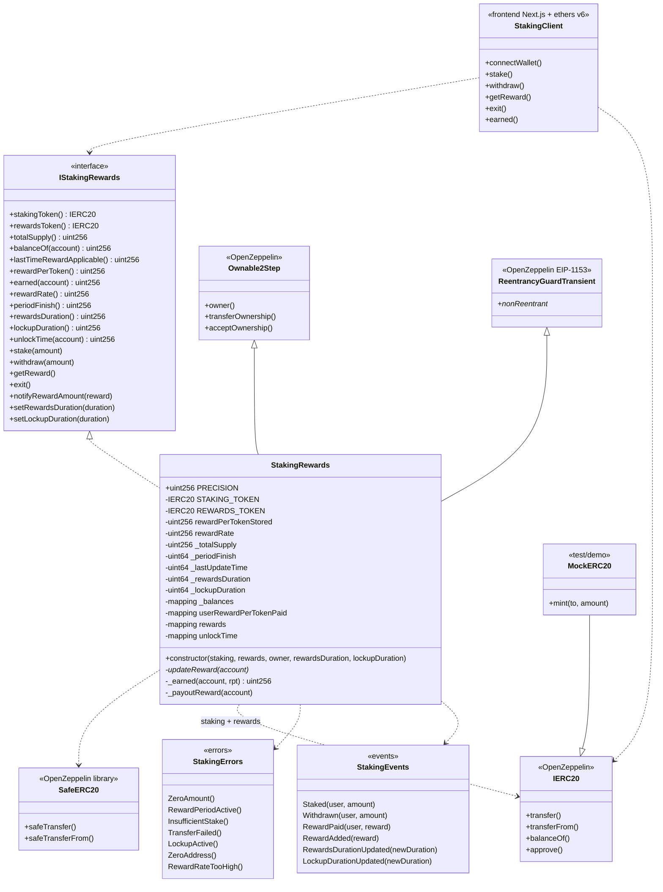

# Class diagram — Staking & Reward Distribution

Static view aligned with the final code (Phases 0–7, 2026-08-27). Synthetix-style O(1).

---

## 1. Class diagram (Mermaid)



---

## 2. Responsibilities

| Type | Responsibility |
|------|-----------------|
| `IStakingRewards` | Stable public surface for tests, scripts and UI |
| `StakingRewards` | O(1) accounting, lockup, reward periods, CEI |
| OZ Ownable2Step | Admin: notify, durations, 2-step ownership |
| OZ ReentrancyGuardTransient | Mutator hardening (Cancun / EIP-1153) |
| `SafeERC20` | ERC-20 transfers without assuming the classic bool return |
| `MockERC20` | Test / demo tokens |
| `StakingClient` | Phase 6 demo (`frontend/`) |

---

## 3. Critical state (Synthetix model)

```text
Global:
  rewardPerTokenStored   // scaled accumulator
  rewardRate             // reward tokens / second
  lastUpdateTime         // uint64 packed
  periodFinish           // uint64 packed
  totalSupply            // total staked
  rewardsDuration        // uint64 packed
  lockupDuration         // uint64 packed

Per user:
  balances[user]
  userRewardPerTokenPaid[user]
  rewards[user]          // pending claimable
  unlockTime[user]       // dynamic lockup
```

### Formulas (reference)

```text
lastTimeRewardApplicable = min(block.timestamp, periodFinish)

rewardPerToken =
  rewardPerTokenStored
  + (deltaTime * rewardRate * PRECISION) / totalSupply
  // if totalSupply == 0 → the accumulator does not advance

earned(user) =
  rewards[user]
  + balances[user] * (rewardPerToken - userRewardPerTokenPaid[user]) / PRECISION
```

`PRECISION`: **`1e18`**. Details: [`04-modelo-matematico-EN.md`](./04-modelo-matematico-EN.md).

---

## 4. Solidity layout (implemented)

1. SPDX + `pragma solidity 0.8.24;`
2. OZ imports + interface
3. State (immutables, `uint64` ×4 packing, mappings)
4. `updateReward` modifier
5. Constructor
6. Views → mutators → admin → private (`_earned`, `_payoutReward`)

---

## 5. Design decisions (v1)

| Topic | Decision |
|------|----------|
| `stakingToken == rewardsToken` | Allowed |
| `Pausable` | Not in v1 |
| `exit()` | Yes |
| Fee-on-transfer / rebase | Not supported (honest ERC-20s) |
| `notifyRewardAmount` | Tokens already in the contract; only updates accounting |
| Guard | `ReentrancyGuardTransient` (not classic storage) |
