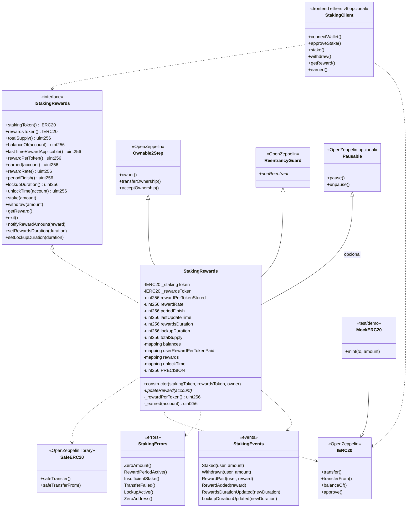

# Diagrama de clases — Staking & Reward Distribution

Vista estática de tipos, responsabilidades y relaciones. Alineado al plan v1 (Synthetix-style O(1)). Actualizar tras cada fase aprobada si el código diverge.

---

## 1. Diagrama de clases (Mermaid)



---

## 2. Responsabilidades

| Tipo | Responsabilidad |
|------|-----------------|
| `IStakingRewards` | Superficie pública estable para tests, scripts y UI |
| `StakingRewards` | Contabilidad O(1), lockup, periodos de reward, CEI |
| OZ Ownable2Step | Admin: notify, durations, ownership 2-step |
| OZ ReentrancyGuard | Blindaje en withdraw/getReward/exit |
| `SafeERC20` | Transfers ERC-20 sin asumir retorno bool clásico |
| `MockERC20` | Tokens de prueba / demo |
| `StakingClient` | Solo si se autoriza Fase 6 |

---

## 3. Estado crítico (modelo Synthetix)

```text
Global:
  rewardPerTokenStored   // acumulador escalado
  rewardRate             // tokens reward / segundo (escalado en uso)
  lastUpdateTime
  periodFinish
  totalSupply            // total staked
  rewardsDuration
  lockupDuration

Por usuario:
  balances[user]
  userRewardPerTokenPaid[user]
  rewards[user]          // pending claimable
  unlockTime[user]       // lockup dinámico
```

### Fórmulas (referencia)

```text
lastTimeRewardApplicable = min(block.timestamp, periodFinish)

rewardPerToken =
  rewardPerTokenStored
  + (deltaTime * rewardRate * PRECISION) / totalSupply
  // si totalSupply == 0 → no avanza el acumulador

earned(user) =
  rewards[user]
  + balances[user] * (rewardPerToken - userRewardPerTokenPaid[user]) / PRECISION
```

`PRECISION`: `1e18` o `1e36` (fijar en Fase 1).

---

## 4. Layout Solidity esperado

1. SPDX + `pragma solidity 0.8.24;`
2. Imports
3. Errores / eventos (o en interfaz)
4. Constantes (`PRECISION`)
5. Variables de estado (packing consciente)
6. Constructor
7. Modifiers (`updateReward`)
8. Externals → publics → internals → privates
9. Views de math al final o junto a mutators según legibilidad

---

## 5. Notas de diseño abiertas (resolver en Fase 1)

- ¿`stakingToken == rewardsToken` permitido?
- ¿Pausable en v1?
- ¿`exit()` en interfaz mínima?
- ¿Fee-on-transfer: revert documental o medición por delta?
