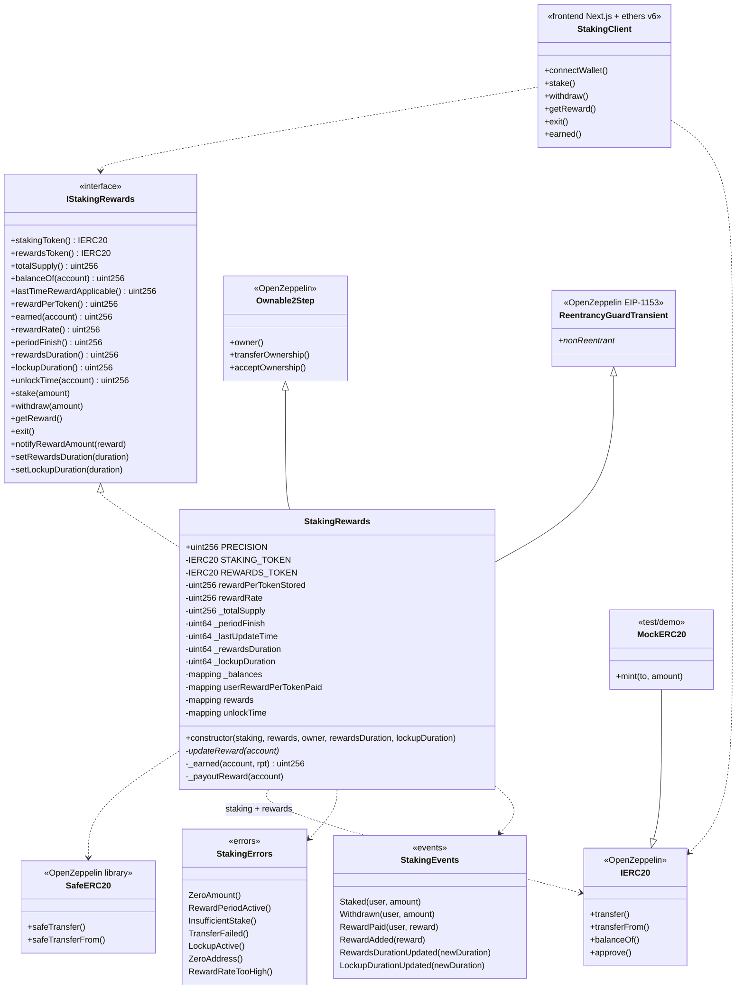

# Diagrama de clases — Staking & Reward Distribution

Vista estática alineada al código final (Fases 0–7, 2026-08-27). Synthetix-style O(1).

---

## 1. Diagrama de clases (Mermaid)



---

## 2. Responsabilidades

| Tipo | Responsabilidad |
|------|-----------------|
| `IStakingRewards` | Superficie pública estable para tests, scripts y UI |
| `StakingRewards` | Contabilidad O(1), lockup, periodos de reward, CEI |
| OZ Ownable2Step | Admin: notify, durations, ownership 2-step |
| OZ ReentrancyGuardTransient | Blindaje mutators (Cancun / EIP-1153) |
| `SafeERC20` | Transfers ERC-20 sin asumir retorno bool clásico |
| `MockERC20` | Tokens de prueba / demo |
| `StakingClient` | Demo Fase 6 (`frontend/`) |

---

## 3. Estado crítico (modelo Synthetix)

```text
Global:
  rewardPerTokenStored   // acumulador escalado
  rewardRate             // tokens reward / segundo
  lastUpdateTime         // uint64 packed
  periodFinish           // uint64 packed
  totalSupply            // total staked
  rewardsDuration        // uint64 packed
  lockupDuration         // uint64 packed

Por usuario:
  balances[user]
  userRewardPerTokenPaid[user]
  rewards[user]          // pending claimable
  unlockTime[user]       // lockup dinámico
```

### Fórmulas (referencia)

```text
lastTimeRewardApplicable = min(block.timestamp, periodFinish)

rewardPerToken =
  rewardPerTokenStored
  + (deltaTime * rewardRate * PRECISION) / totalSupply
  // si totalSupply == 0 → no avanza el acumulador

earned(user) =
  rewards[user]
  + balances[user] * (rewardPerToken - userRewardPerTokenPaid[user]) / PRECISION
```

`PRECISION`: **`1e18`**. Detalle: [`04-modelo-matematico.md`](./04-modelo-matematico.md).

---

## 4. Layout Solidity (implementado)

1. SPDX + `pragma solidity 0.8.24;`
2. Imports OZ + interfaz
3. Estado (immutables, packing `uint64` ×4, mappings)
4. Modifier `updateReward`
5. Constructor
6. Views → mutators → admin → privados (`_earned`, `_payoutReward`)

---

## 5. Decisiones de diseño (v1)

| Tema | Decisión |
|------|----------|
| `stakingToken == rewardsToken` | Permitido |
| `Pausable` | No en v1 |
| `exit()` | Sí |
| Fee-on-transfer / rebase | No soportado (ERC-20 honestos) |
| `notifyRewardAmount` | Tokens ya en el contrato; solo actualiza contabilidad |
| Guard | `ReentrancyGuardTransient` (no storage clásico) |
