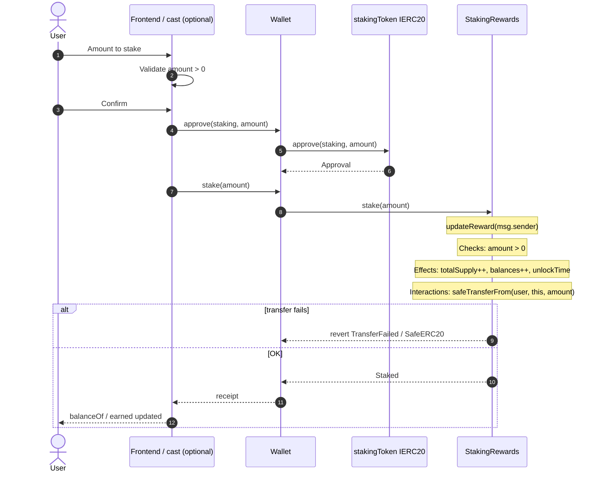
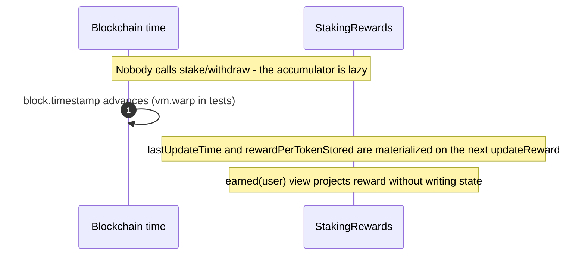
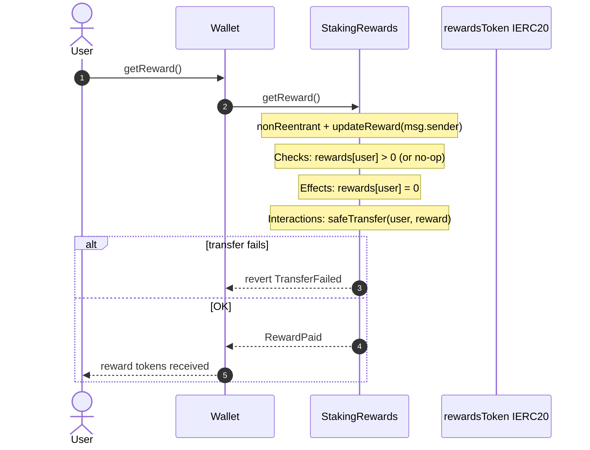
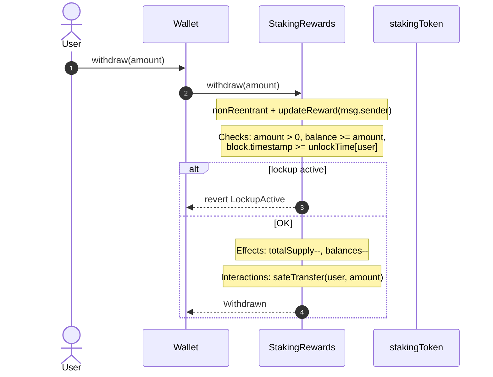
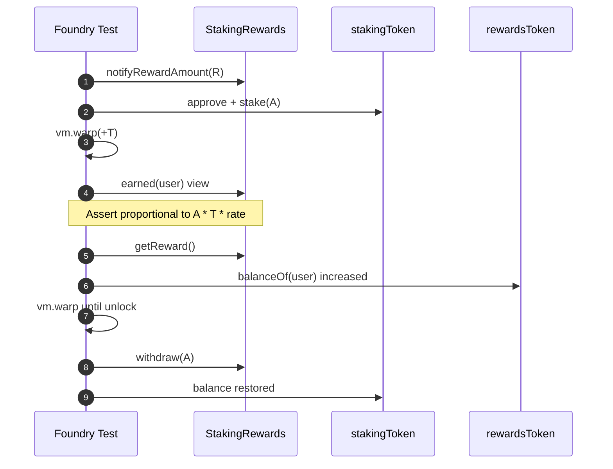
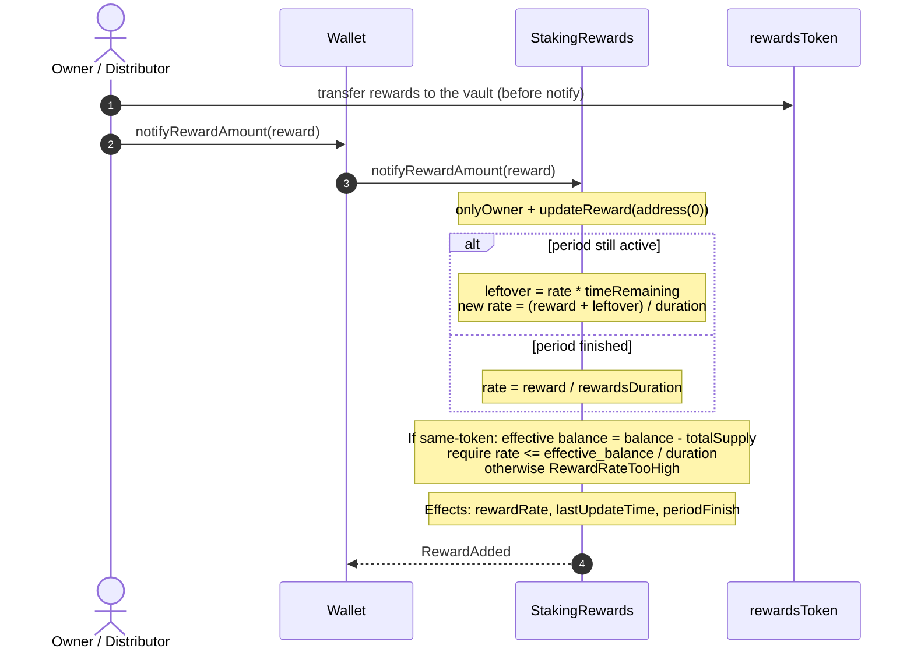
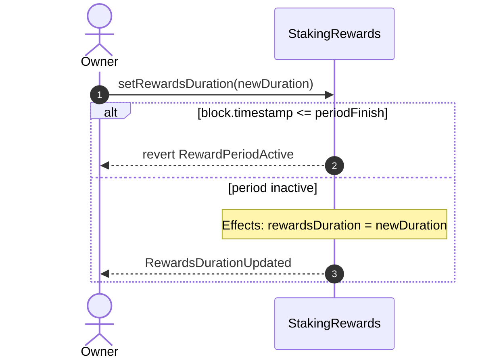
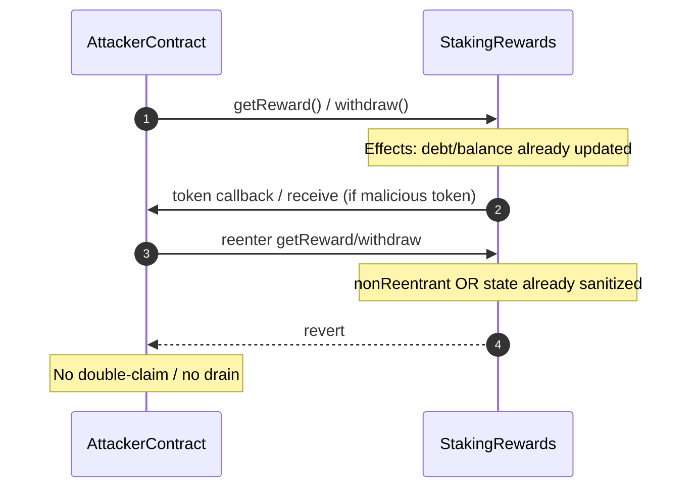

# Flow / sequence diagram — Staking & Reward Distribution

Interaction sequences between **user**, **wallet/frontend** and **StakingRewards** (final v1 code). Complements the [decision flowchart](./03-flujograma-EN.md). Handoff: [`HANDOFF-EN.md`](./HANDOFF-EN.md).

---

## 1. Stake (approve + deposit)

---

## 2. Time-based accrual (no user txs)

---

## 3. Reward claim (`getReward`)

---

## 4. Unstake (`withdraw`) with lockup

---

## 5. Full lifecycle (tests: Stake → warp → Claim → Unstake)

---

## 6. Period funding (`notifyRewardAmount`)

> **v1:** `notify` does not perform `transferFrom`. The tokens must already be in the contract.

---

## 7. Changing `rewardsDuration` (only outside a period)

---

## 8. Reentrancy attack on claim/withdraw (must fail)

