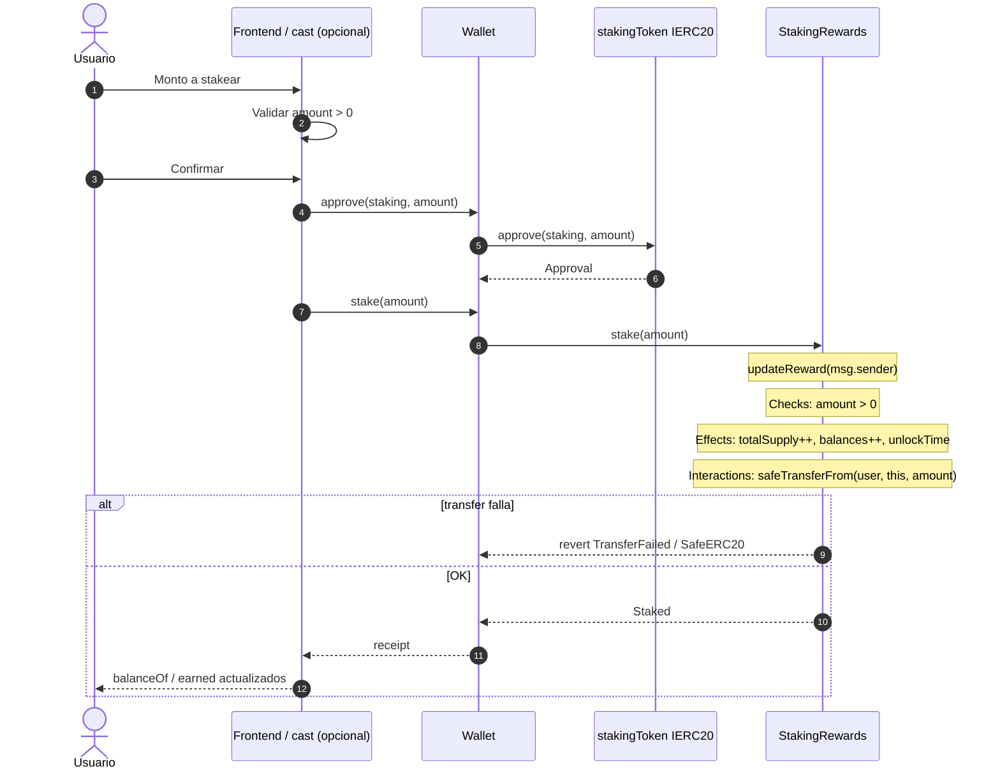
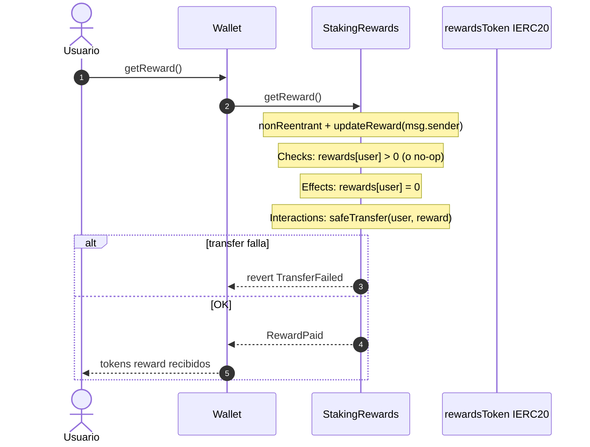
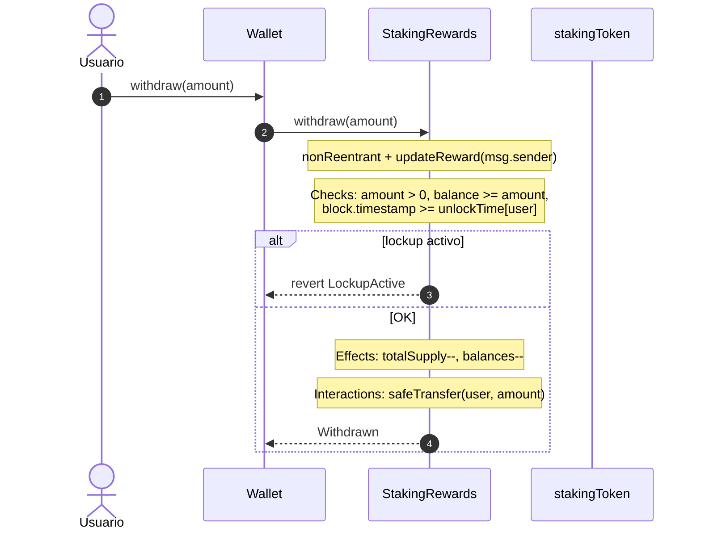
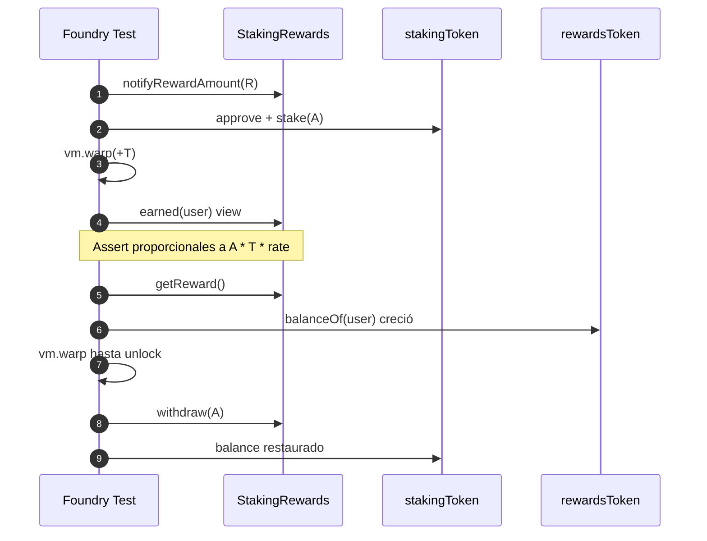
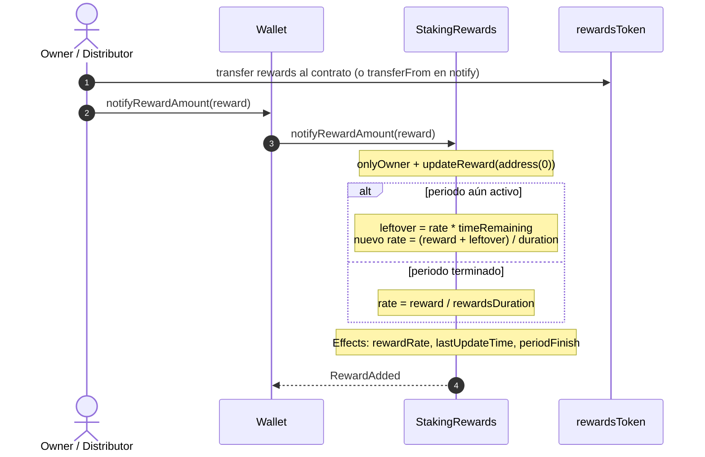
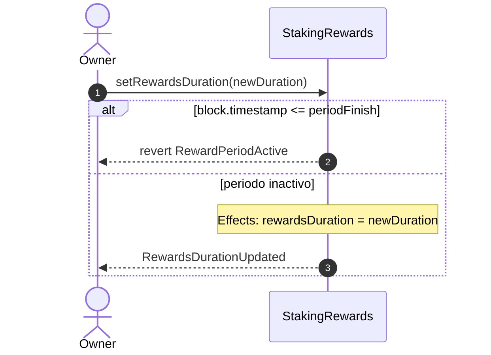
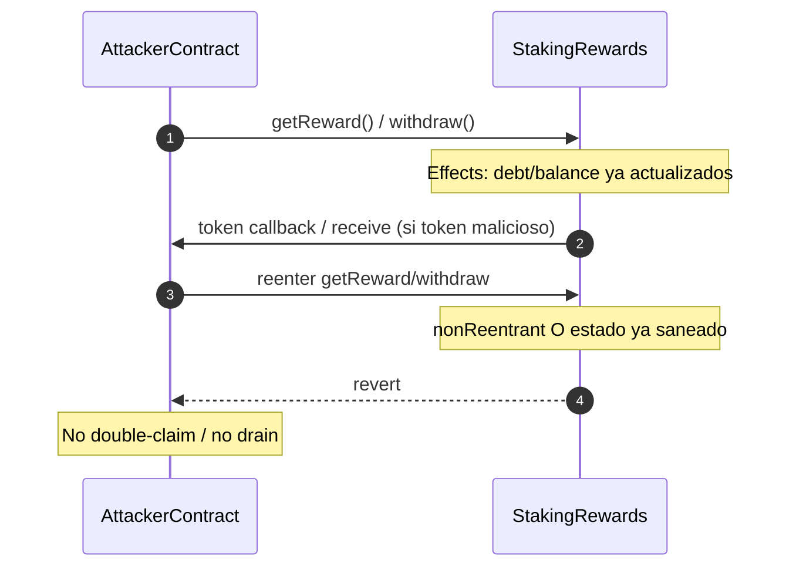

# Diagrama de flujo — Staking & Reward Distribution

Secuencias de interacción entre **usuario**, **wallet/frontend** y **StakingRewards**. Complementa el [flujograma de decisiones](./03-flujograma.md).

---

## 1. Stake (approve + deposit)



---

## 2. Acumulación temporal (sin txs de usuario)

```mermaid
sequenceDiagram
    autonumber
    participant Chain as Blockchain time
    participant S as StakingRewards

    Note over Chain,S: Nadie llama stake/withdraw; el acumulador es lazy
    Chain->>Chain: block.timestamp avanza (vm.warp en tests)
    Note over S: lastUpdateTime y rewardPerTokenStored<br/>se materializan en el próximo updateReward
    Note over S: earned(user) view proyecta reward sin escribir estado
```

---

## 3. Claim de rewards (`getReward`)



---

## 4. Unstake (`withdraw`) con lockup



---

## 5. Lifecycle completo (tests: Stake → warp → Claim → Unstake)



---

## 6. Funding de periodo (`notifyRewardAmount`)



---

## 7. Cambio de `rewardsDuration` (solo fuera de periodo)



---

## 8. Ataque de reentrancy en claim/withdraw (debe fallar)


