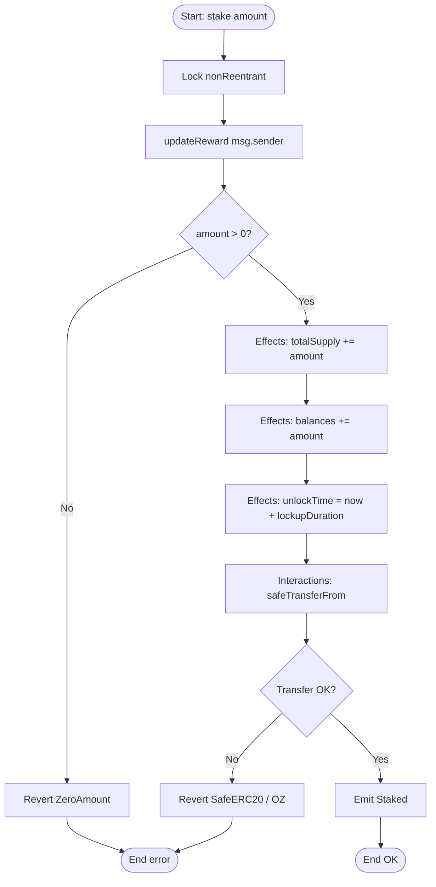
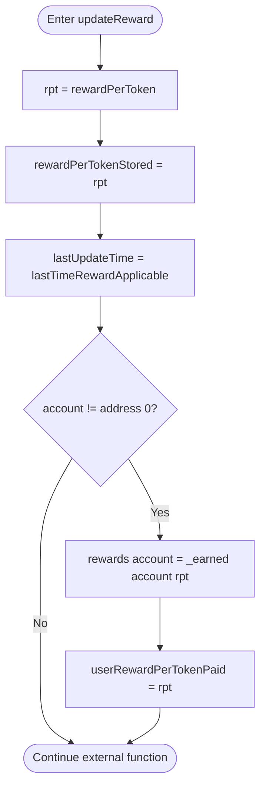
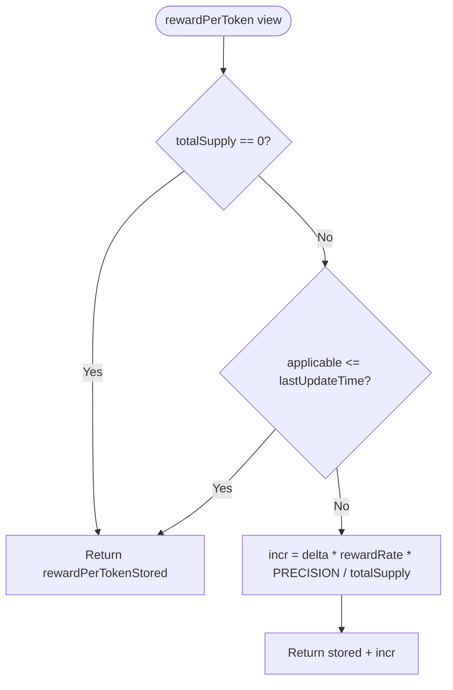
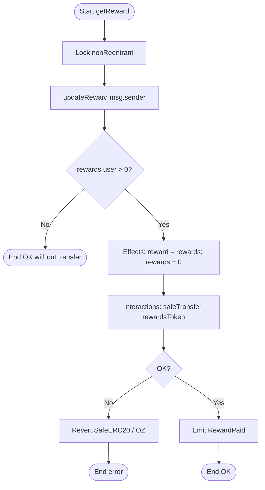
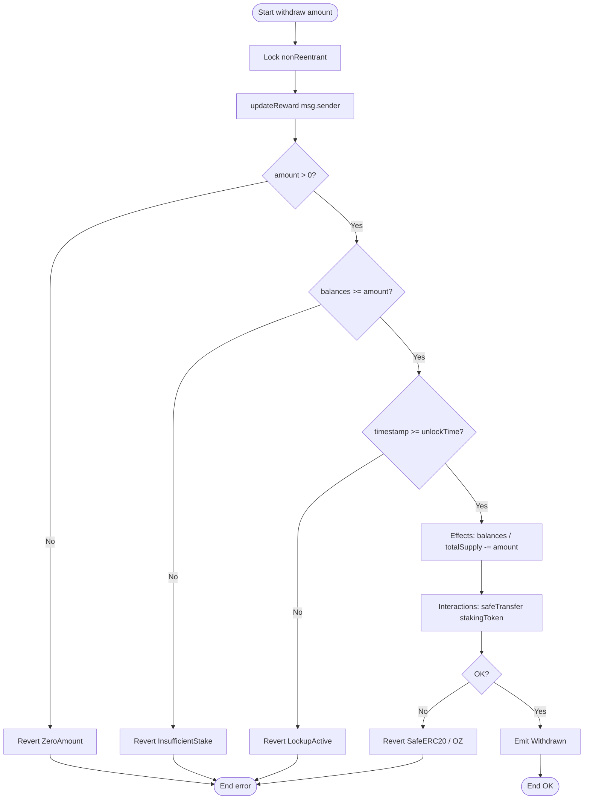
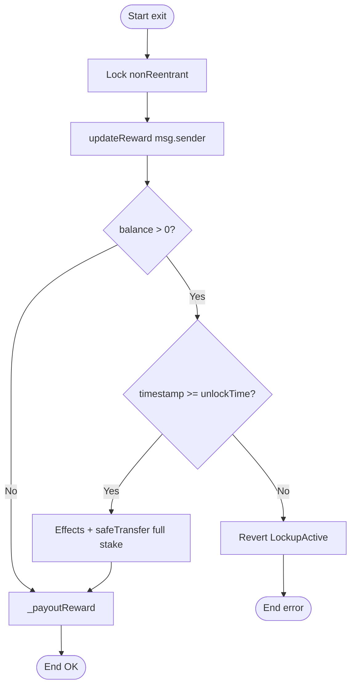
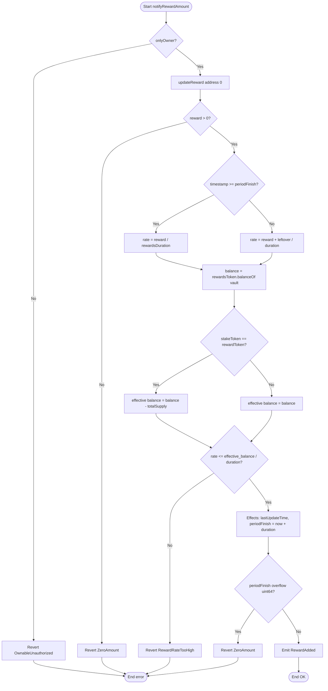
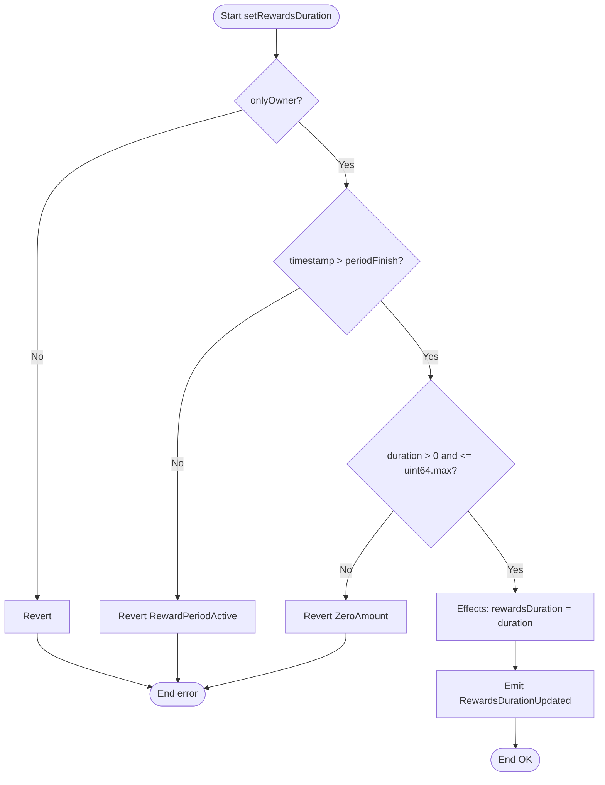
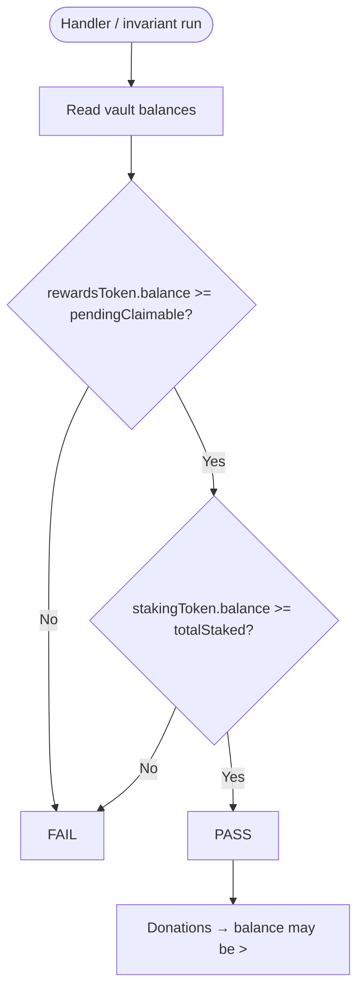
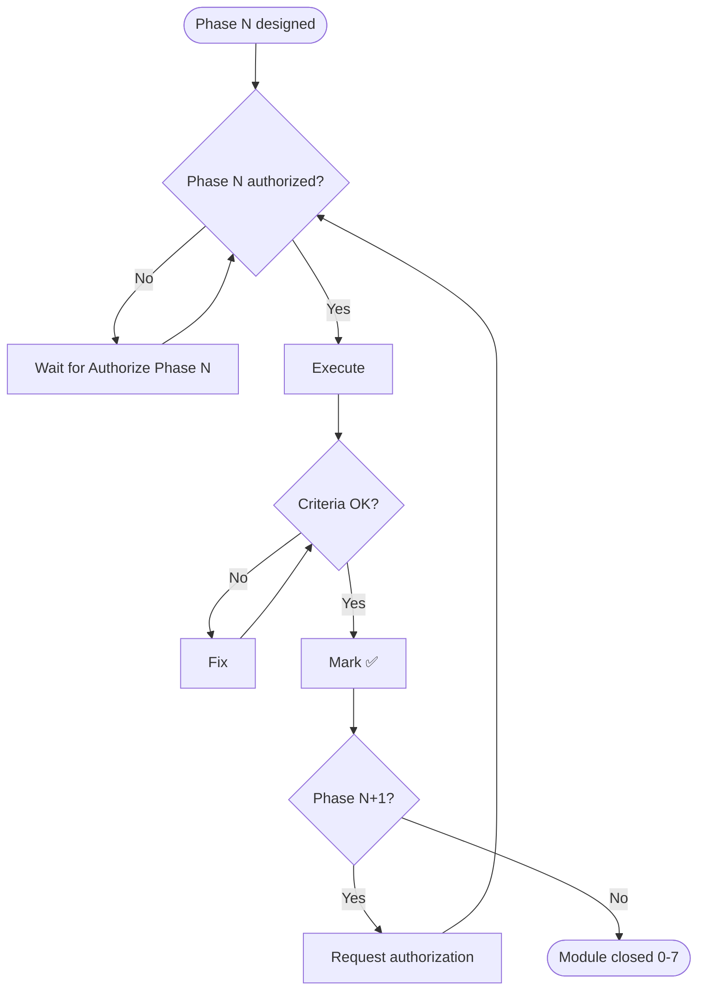

# Flowchart — Staking & Reward Distribution

Decision diagrams (yes/no) aligned with the v1 code. Sequences: [`02-diagrama-flujo-EN.md`](./02-diagrama-flujo-EN.md). Handoff: [`HANDOFF-EN.md`](./HANDOFF-EN.md).

Actual modifier order in user mutators: `nonReentrant` → `updateReward` → body (amount/lockup checks).

---

## 1. Flowchart: `stake`

---

## 2. Flowchart: `updateReward(account)` (modifier)

---

## 3. Flowchart: `getReward`

---

## 4. Flowchart: `withdraw`

---

## 5. Flowchart: `exit`

---

## 6. Flowchart: `notifyRewardAmount`

> **v1:** there is no `transferFrom` inside `notify`. The owner must have transferred tokens to the vault **beforehand**.

---

## 7. Flowchart: `setRewardsDuration`

---

## 8. Flowchart: vault invariant (tests)

---

## 9. Flowchart: phase authorization (historical)

---

## 10. Quick legend

| Symbol | Meaning |
|---------|-------------|
| Oval | Start / end |
| Rectangle | Process or effect |
| Diamond | Decision |
| CEI | Checks → Effects → Interactions |
| `updateReward` | Materializes accumulator + user debt O(1) |
| Lockup | `timestamp >= unlockTime` before withdraw/exit |
| SafeERC20 | OZ reverts; `TransferFailed` is in the interface but not used in the impl |
