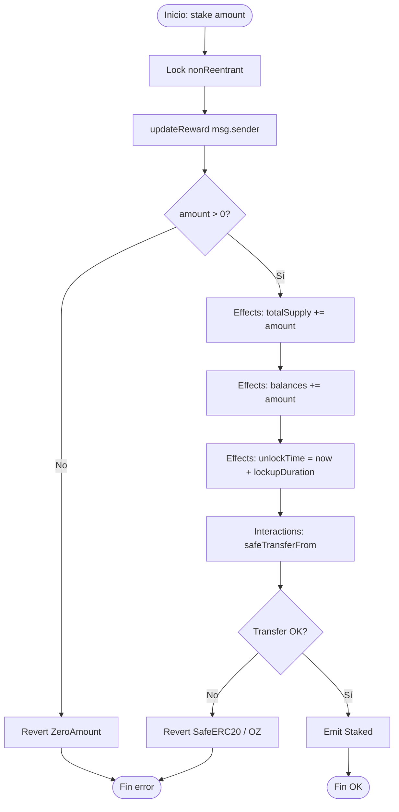
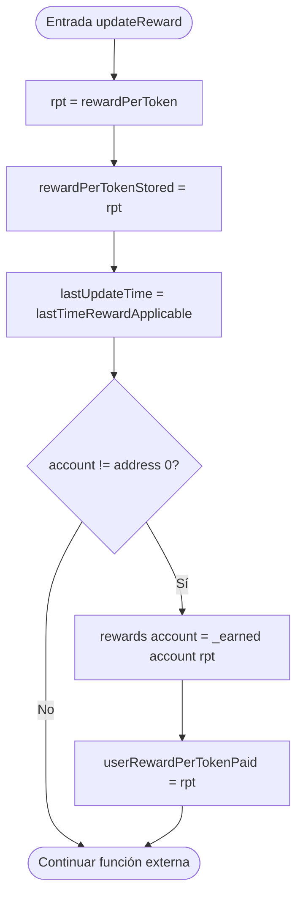
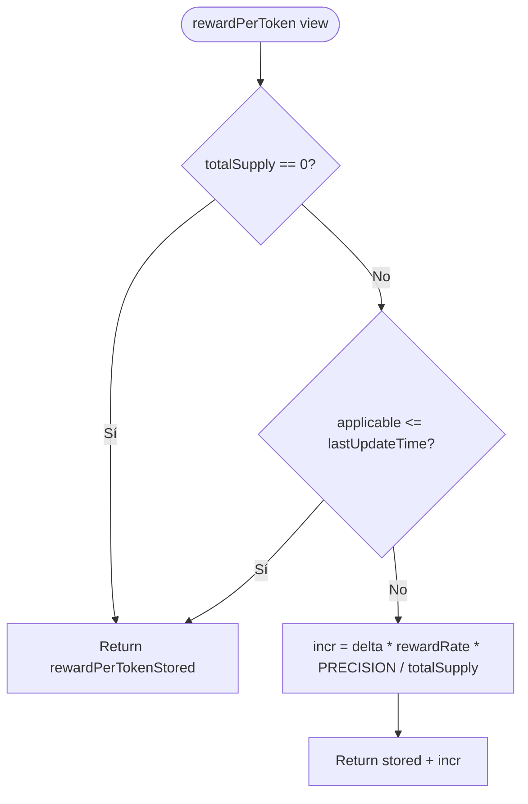
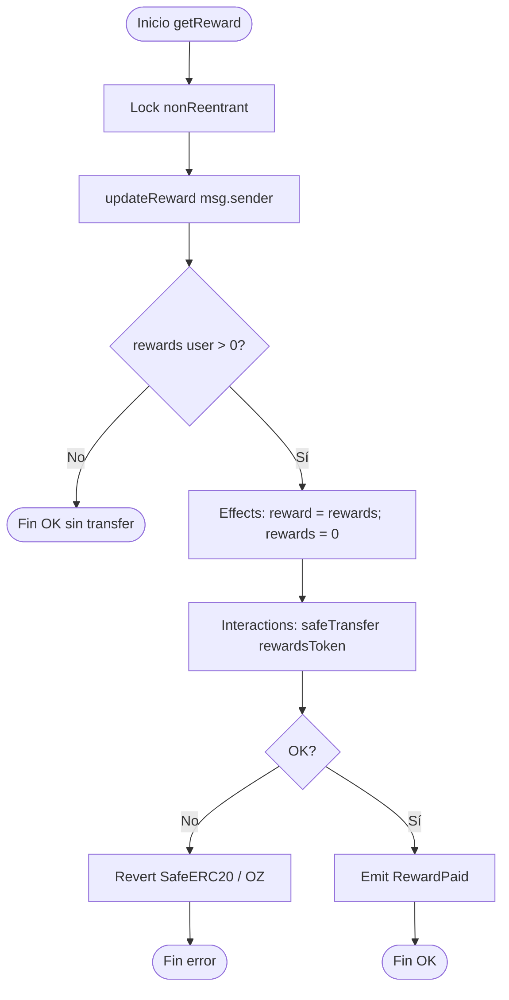
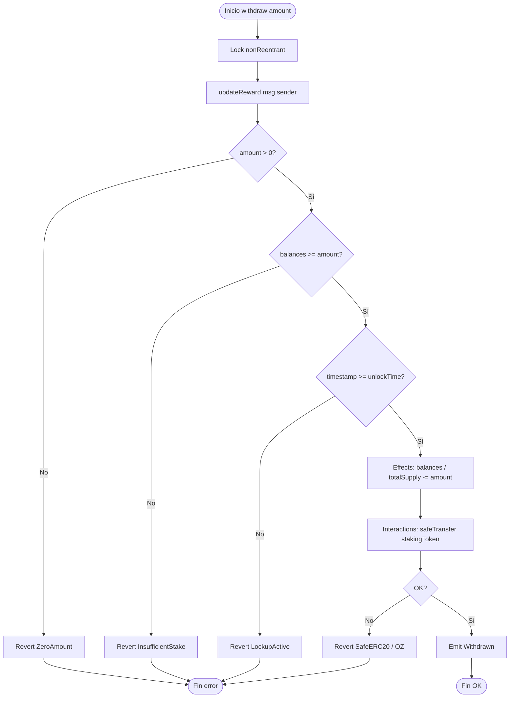
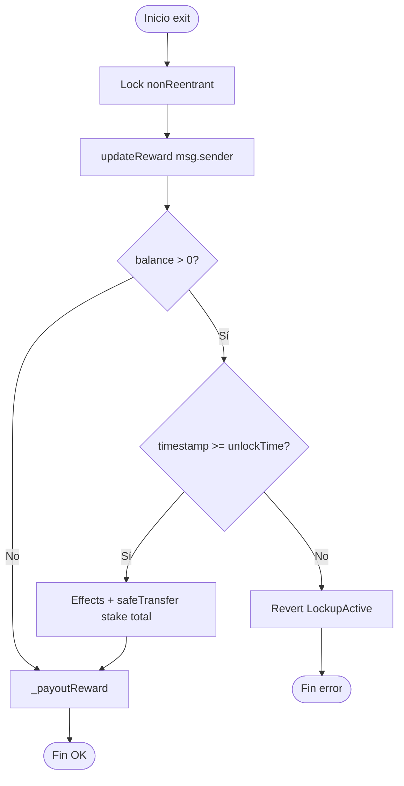
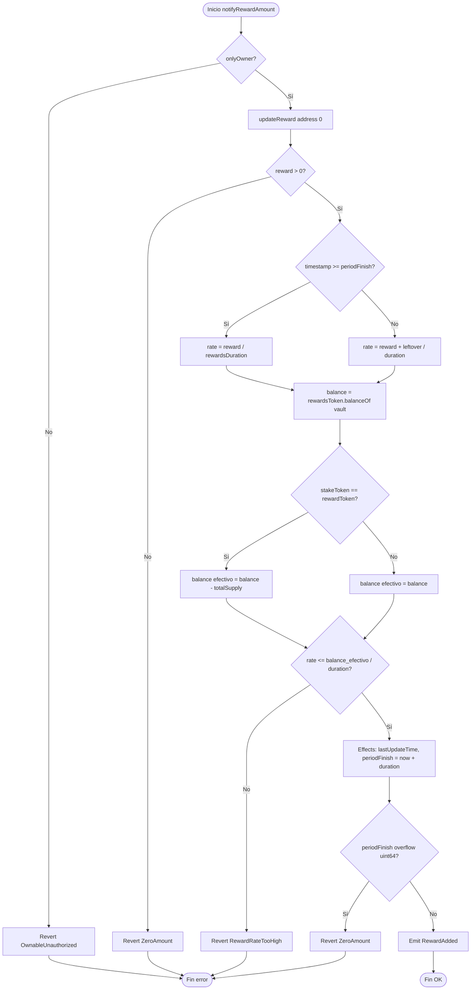
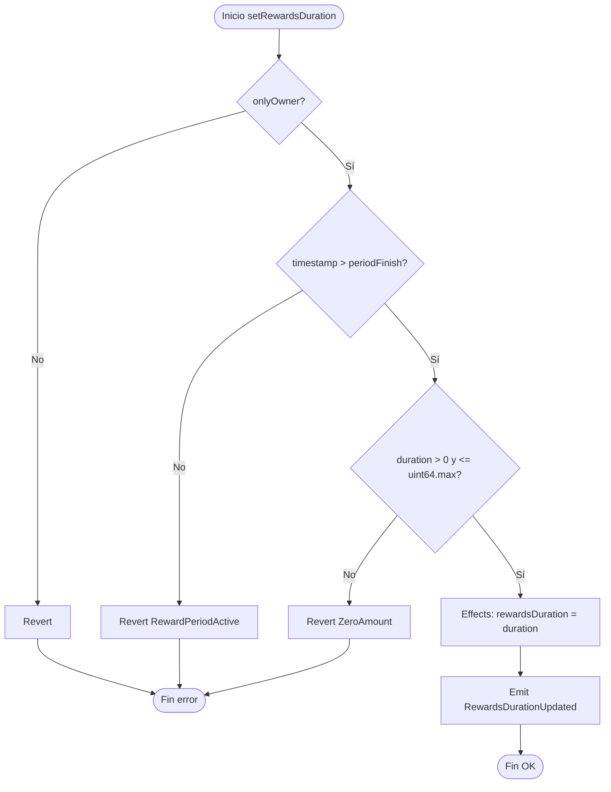
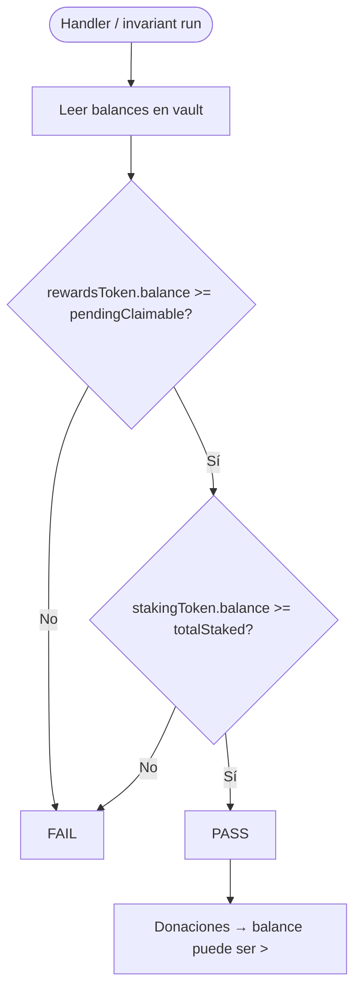
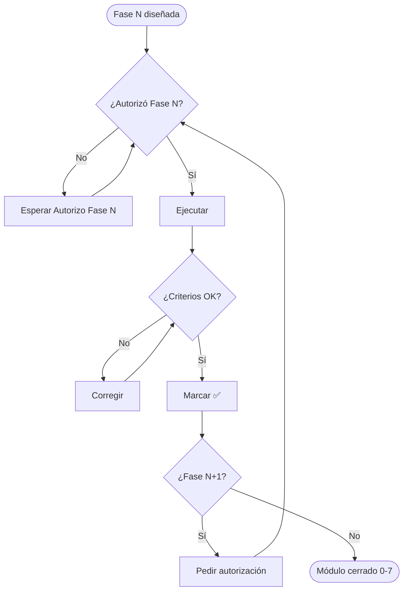

# Flujograma — Staking & Reward Distribution

Diagramas de decisión (sí/no) alineados al código v1. Secuencias: [`02-diagrama-flujo.md`](./02-diagrama-flujo.md). Handoff: [`HANDOFF.md`](./HANDOFF.md).

Orden real de modifiers en mutators de usuario: `nonReentrant` → `updateReward` → cuerpo (checks de amount/lockup).

---

## 1. Flujograma: `stake`

---

## 2. Flujograma: `updateReward(account)` (modifier)

---

## 3. Flujograma: `getReward`

---

## 4. Flujograma: `withdraw`

---

## 5. Flujograma: `exit`

---

## 6. Flujograma: `notifyRewardAmount`

> **v1:** no hay `transferFrom` dentro de `notify`. El owner debe haber transferido tokens al vault **antes**.

---

## 7. Flujograma: `setRewardsDuration`

---

## 8. Flujograma: invariante de vault (tests)

---

## 9. Flujograma: autorización de fases (histórico)

---

## 10. Leyenda rápida

| Símbolo | Significado |
|---------|-------------|
| Óvalo | Inicio / fin |
| Rectángulo | Proceso o efecto |
| Rombo | Decisión |
| CEI | Checks → Effects → Interactions |
| `updateReward` | Materializa acumulador + deuda usuario O(1) |
| Lockup | `timestamp >= unlockTime` antes de withdraw/exit |
| SafeERC20 | Reverts OZ; `TransferFailed` está en interfaz pero no se usa en impl |
