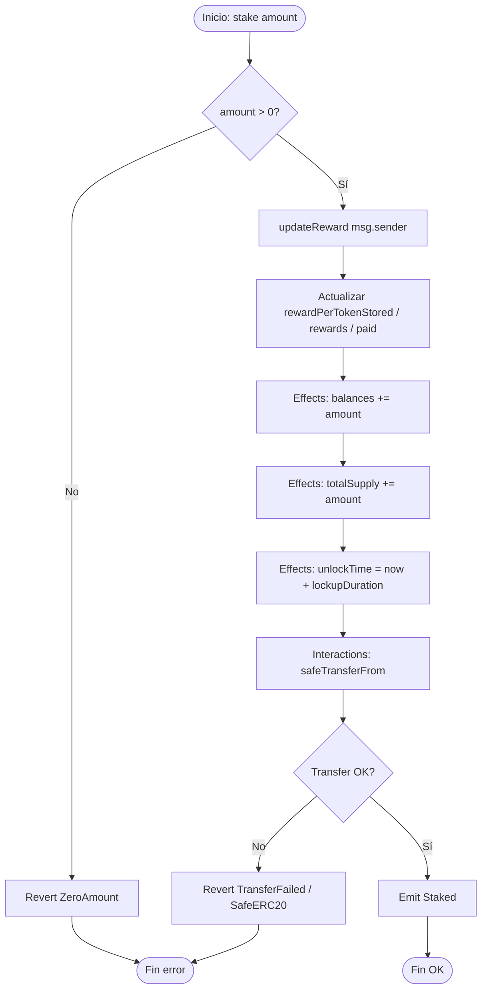
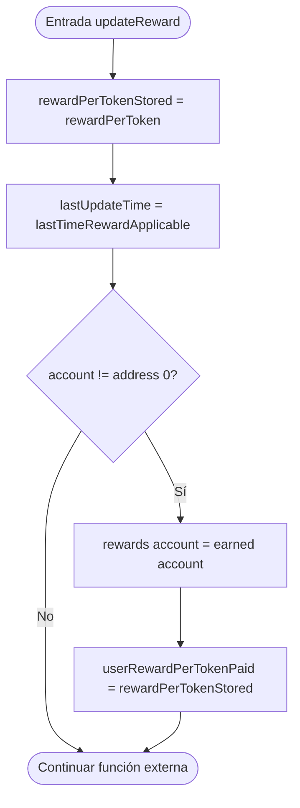
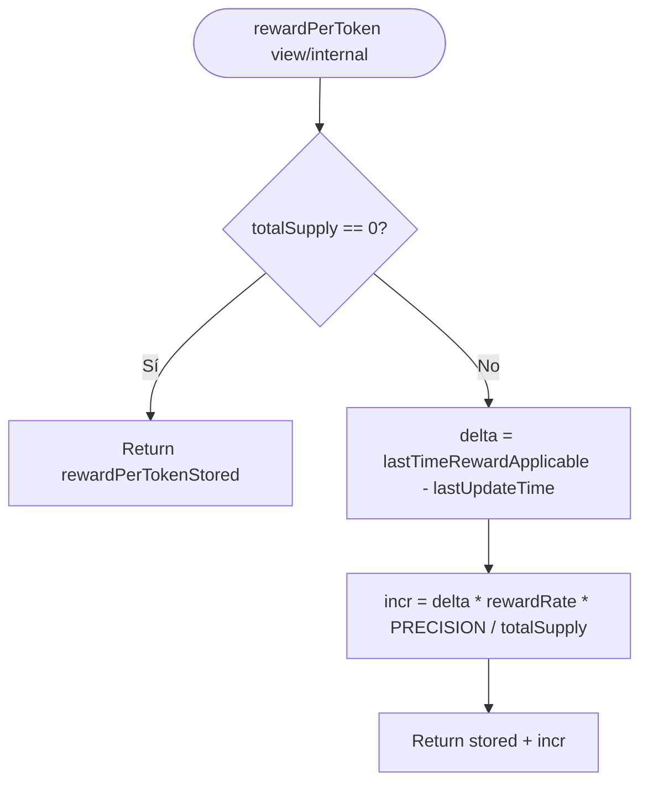
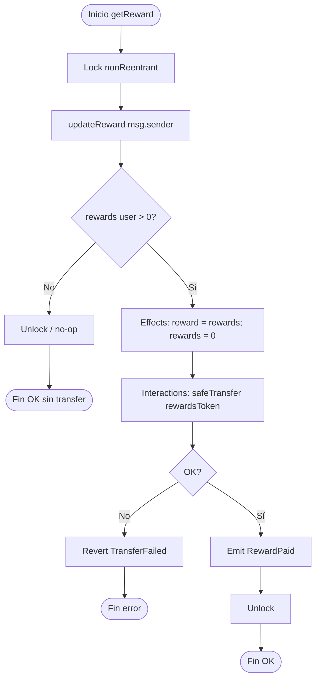
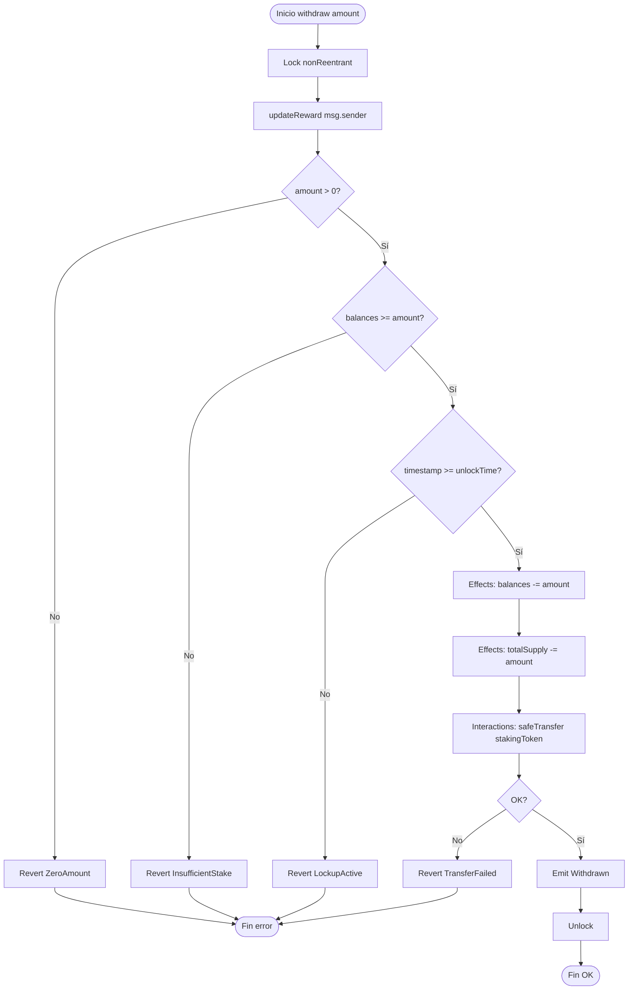
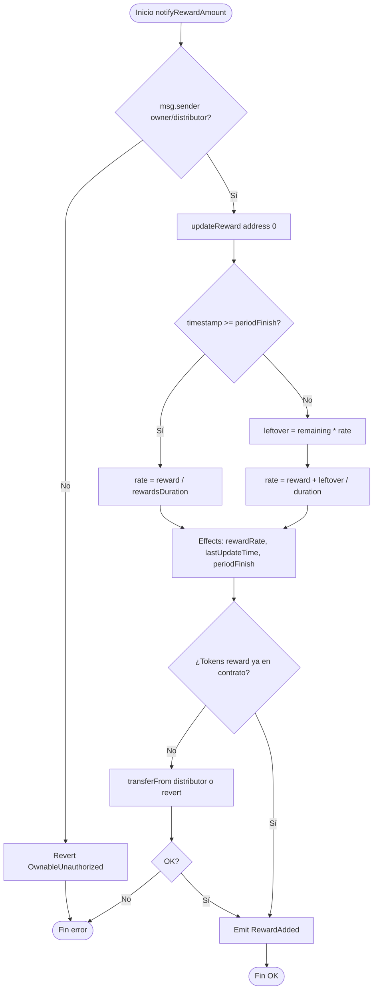
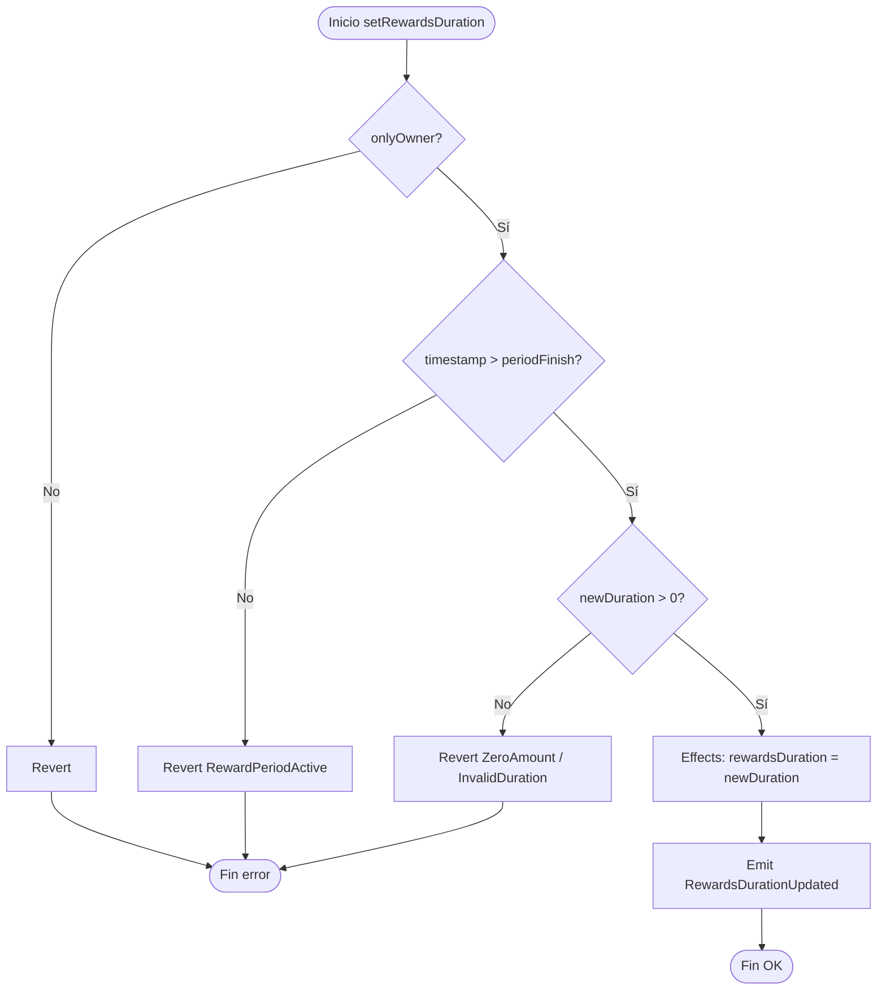
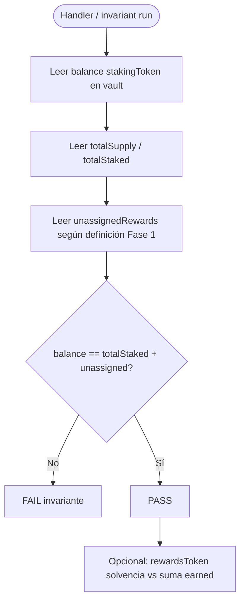
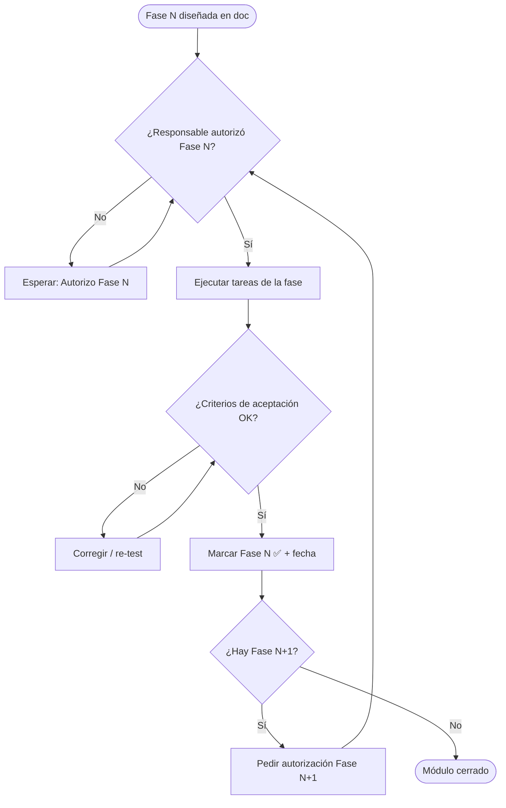

# Flujograma — Staking & Reward Distribution

Diagramas de decisión (sí/no) para operaciones críticas. Ver también el [diagrama de flujo / secuencias](./02-diagrama-flujo.md).

---

## 1. Flujograma general: `stake`

---

## 2. Flujograma: `updateReward(account)` (modifier)

---

## 3. Flujograma: `getReward`

---

## 4. Flujograma: `withdraw`

---

## 5. Flujograma: `notifyRewardAmount`

---

## 6. Flujograma: `setRewardsDuration`

---

## 7. Flujograma: invariante de vault (tests)

---

## 8. Flujograma: autorización de fases (proceso de desarrollo)

---

## 9. Leyenda rápida

| Símbolo | Significado |
|---------|-------------|
| Óvalo | Inicio / fin |
| Rectángulo | Proceso o efecto de estado |
| Rombo | Decisión |
| CEI | Checks → Effects → Interactions |
| `updateReward` | Materializa acumulador global y deuda del usuario en O(1) |
| Lockup | `block.timestamp >= unlockTime[user]` antes de withdraw |
